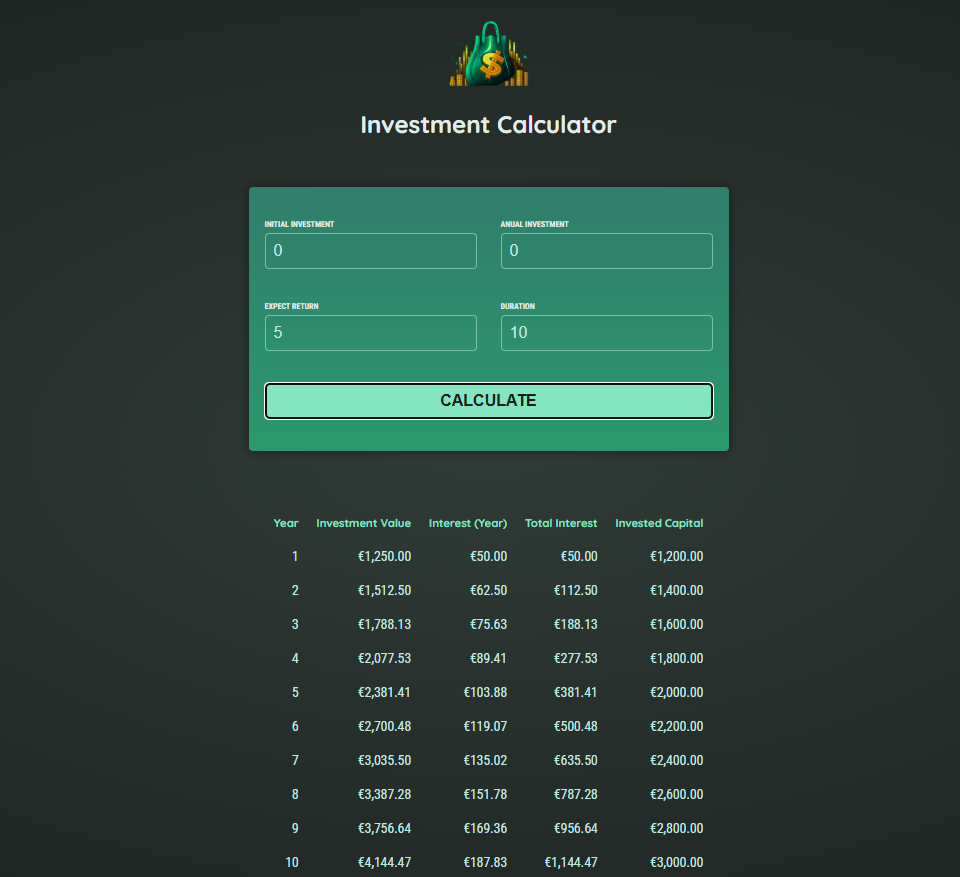

# Investment Calculator – Angular Essentials Practice

<p align="center">
  
</p>

## Project Overview

This project is an **Investment Calculator** built to practice and demonstrate core Angular essentials. It allows users to input investment parameters and view calculated results, reinforcing concepts such as components, services, data binding, and modular architecture. Following Udemy Course - Angular The Complete Guide by Academind.

## Technologies & Versions

- **Angular**: 18.0.0-next.2
- **TypeScript**: 5.x
- **Node.js**: 20.x (recommended)
- **Angular CLI**: 18.0.0-next.2

## Features

- User-friendly form for investment input
- Real-time calculation and display of investment results
- Modular component structure (input, results, header)
- Service-based business logic

## Purpose

This project is designed as a hands-on exercise to apply and reinforce Angular essentials, including:

- Component communication
- Data binding (one-way, two-way)
- Dependency injection and services
- Angular module organization

## Getting Started

1. **Install dependencies:**
   ```sh
   npm install
   ```
2. **Run the development server:**
   ```sh
   ng serve
   ```
   Navigate to [http://localhost:4200/](http://localhost:4200/) in your browser.

## License

This project is for educational purposes only.
